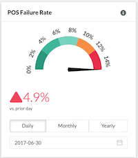

[](https://papers.ssrn.com/sol3/papers.cfm?abstract_id=3595344)

## Table of Contents

- [Overview](#overview)
  - [Architecture](#architecture)
  - [Screenshots](#screenshots)
  - [Expectations](#expectations)
  - [Limitations](#limitations)
- [Getting Started](#getting-started)
  - [Dependencies](#dependencies)
  - [Installation and Startup](#installation-and-startup)
- [Configuration](#configuration)
  - [Environments](#environments)
  - [Data Sources](#data-sources)
  - [Side Navigation](#side-navigation)
  - [Dashboard Layouts](#dashboard-layouts)
    - [Sections](#sections)
    - [Elements](#elements)
    - [Components](#components)
  - [Maps](#maps)
    - [Layers](#layers)
    - [Filters](#filters)

## Known TODOs for README

- Review/update documentation for BigQuery backend
- Update documentation for leaflet map styling as alternative to CartoCSS
- Update documentation for use with datastack-backend

# Overview

[**DataStack**](https://papers.ssrn.com/sol3/papers.cfm?abstract_id=3595344) uses a new form of data architecture whose object is to increase and improve the
Volume, Variety, Velocity, and Accuracy of data available to financial authorities and other stakeholders.

This architecture seeks to collect, process, and draw insights from data that is Trusted, Timely, and Comprehensive, including transactional data, other data from financial institutions/agents, and non-financial data.

## Architecture

The [DataStack](https://papers.ssrn.com/sol3/papers.cfm?abstract_id=3595344) is multi-tiered or layered series of applications that perform specific functions relating to collecting, processing, and drawing insights.


The front-end web-based application that resides within this repository is focused on providing the last layer - outputs.

## Screenshots


## Expectations

It is expected for this front-end application to integrate with a pre-existing back-end API that can provide authentication and the endpoints/data needed to render the visualizations.

## Limitations

- The current implementation of the authentication system assuming using a token authorization strategy ('Bearer token' in the header).
- While there are UI modules in place to adjust how the map layers are displayed, all data sources, dashboard layouts, and menu items are currently set up using configuration files and cannot yet be modified in the front-end app. For more information on the structure of these files, see the ['configuration' section](#configuration) below.

# Getting Started

## Dependencies

- Angular CLI globally installed
- Node version 10.x or 12.x

## Installation and Startup

1. Clone the repository so you have a working copy on your local machine
2. Using your preferred shell, navigate into the root of the working copy
3. Install the dependencies by running `npm install`
4. Run the application by using the command `ng serve`
5. If using BigQuery as a backend (e.g. in place of APIs), clone `datastack-backend` repository and follow instructions to get up and running

# Configuration

The following configurations are intended to eventually be dynamically loaded based on an individual user's permission and access level. In the interim, these are statically set in JSON files.

## Environments

The environments configuration files determine which servers your front-end application will communicate with in regard to system-level functionality and also the Carto instance used to load map data.

- `production`: Indicates if the API should be launched in debug mode for testing
- `baseURL`: the API that will provide system-level functionality such as authentication
- `cartoCredentials`: a credentials object used to optionally connect to a Carto instance (documented [below](#carto-credentials))
- `bigQueryCredentials`: a credentials object used to optionally connect to a BigQuery backend (documented [below](bigquery-credentials))

Located at: `src/environments/environment.ts`

```{json}
  production: false,
  baseURL: "https://datastack.global/api",
  cartoCredentials: {
    apiKey: "abcdef12345abcdef",
    username: 'carto-username',
    apiUrl: "https://carto.com/user/{username}/api/v2",
  },
  bigQueryCredentials: {
    projectName: "project-name",
    apiUrl: "https://bigquery.googleapis.com/bigquery/v2"
  }
```

### Carto Credentials

- `apiKey`: a Carto instance issued API key
- `username`: the username the Carto instance issued the API key for
- `apiURL`: the URL of the API for which the issued API key is valid. This value can use a substitution value (`{username}`) to dynamically add the username to the path. Typically ends with `/api/v2`.

### BigQuery Credentials

- `projectName`: the name of the project on GCP
- `apiURL`: the URL of the API for which the service is pointing to. Typically ends with `/api/v2` but can use other versions.

## Data Sources

The data sources file is a collection of Open API 3.0 specifications that are used to populate the data displayed in dashboard visualizations. These specifications are used to determine how the dashboard can fetch the data required, what parameters are available for filtering, and how the data is to be interpreted for use. These specifications also have been minorly enhanced with the addition of a few extra non-Open API 3.0 keys to add missing details required for interpretation including:

- `id`: Additional root-level parameter that allows the system to reference a particular Open API 3.0 spec from the collection.
- `date` enum type: Assigned to a parameter's schema's `type`. Used to indicate if a property is a date value.
- `option`: Assigned to a parameter's schema object for `date` types. Determines if a date parameter is the start or end of a filterable date-range. Acceptable values are either `lower-limit` or `upper-limit`
- `format`: Assigned to a parameter's schema object for `date` types. Indicates how a given date value is to be parsed or formatted by the system.
- `mapsToInResponse`: Assigned to a parameter to link ranged parameters such as `startDate` and `stopDate` to the field returned in the response with a different name such as `date`.

All other key documentation can be found on the [Open API 3.0 website](http://spec.openapis.org/oas/v3.0.0).

Individual specs from the collection can also be viewed, modified, and validated using [Swagger's online editor](https://editor.swagger.io).

Located at: `src/assets/json/datasources.json`

Sample configuration at:  [readme-assets/sample-configs/datasources-sample.json](readme-assets/sample-configs/datasources-sample.json)

## Side Navigation

The pages available on the app's side-navigation are defined in `menu.json`. By default, if a `layout_url` is not provided, the map page will be displayed. The structure of this file is an array of item objects. Each item object has the following structure:

- `icon`: A fontawesome.com v5.0 class used to populate the icon displayed next to the title.
- `title`: The name of the page in the side navigation menu. This is helpful to have as a separate key from the `pageTitle` as the side navigation has less space for longer titles.
- `pageTitle`: The name at the top of the page when selected to be displayed.
- `href`: The web-safe resource name added after `/app/` that will be used to link directly to the page. If a dashboard's `layout_url` value is provided, this resource name will be after `/app/dashboard/`.
- `layout_url`: A temporary reference to the dashboard layout configuration. This should eventually be replaced by an endpoint that returns a dashboard layout customized based on a user's access or permissions.
- `authorizedPersonas`: A temporary array of string roles-names that are permitted to access a particular dashboard. If one of the user's roles matches the role-name listed here then that item will show for them in the side navigation menu.

Located at: `src/assets/json/menu.json`

Sample:

```{json}
[
    {
        "icon": "fa fa-map",
        "title": "Map",
        "pageTitle": "Map",
        "href": "map",
        "authorizedPersonas": []
    },
    {
        "icon": "fa fa-chart-bar",
        "title": "Dashboard",
        "pageTitle": "Dashboard",
        "href": "dashboard",
        "layout_url": "assets/json/dashboard.json",
        "authorizedPersonas": []
    }
]
```

## Dashboard Layouts

These layouts are used to determine how visualizations are displayed when a user navigates to a dashboard either by selecting a side navigation menu item or by selecting a data point on the map. This file contains both the structure and organization in addition to configuration for displaying the visualizations themselves.

- Located at: `src/assets/json/dashboard.json`

- Sample dashboard configuration at:  [readme-assets/sample-configs/dashboard-sample.json](readme-assets/sample-configs/dashboard-sample.json)

There are a few main types of entities used in a dashboard layout:

### Sections

A `section` is a visually-configurable collection of visual [elements](#elements).

- `title`: The name displayed at the top of the `section` above the visualizations
- `left`/`right`: The left/right-aligned 'subtitle' content displayed directly below the title. Supports:
  - Substitution values:
    - data loaded time: `%<endpoint-path-id>.loaded-time%`
  - Inline HTML such as anchor tags
- `carousel`: If `true`, Indicates if the `section`'s visualizations should stay in a single row with horizontal scrolling or if `false` it should wrap to a new line.
- `elements`: An array of `element`s (documented [below](#elements)) that are displayed within the `section`

    

    The above image is one `section` with a `title` ("Vital Signs"), `left` ("Latest data as of..."), `right` ("Source:"), and two visualization `element`s.

### Elements

An `element` is a group of visual [component](#components)s or other [element](#elements)s depending on their `type`:

- `id`: value used to identify and reference this specific `element` elsewhere in the layout
- `type`: Determines how this grouping `element` is to be displayed in the system. A list of supported type values include:
  - `visualization`: A collection of charts and filter controls displayed on a 'card' in the layout. Each card has a header with a title, optional toolbar items, and a body of components.

    

    The image above is one visualization that consists of a `speedometer`, `kpi`, `segmented-button` and `date-picker` component

  - `tabs`: adds an array of visual tab modules that each display one `visualization`. These tabs are displayed above the nested visualization.

    

- `classes`: Adds custom styling to the `element`
- `tabs`: Only used by `element`s with a type of `tabs`. An array of [tab elements](#tab-sub-elements).
- `toolbar`: an array of [toolbar items](#toolbar-item).
- `components`: an array of [component](#components)s) that are displayed on a single 'card' on the interface.

#### Tab Sub-Elements

- `title`: The name displayed on the tab
- `visualization`: a single element of type `visualization`.

#### Toolbar Item

- `icon`: A fontawesome.com v5.0 class used to for the button of the toolbar
- `tooltip`: The presence of this key indicates that the toolbar item should display the text assigned as its value.

### Components

A [component](#components) is a visual module that allows a user to view or interact with the data being displayed on a 'card' (i.e. an [element](#elements) of `type`:`visualization`). The visual module that gets rendered is specified by its `type`.  The details and keys unique to the type of [component](#components) are set in the `options` object.  The attributes for a [component](#components) are:

- `id`: a unique identifier used to link functionality between different `component`s
- `showLoading`: Determines if the element will wait for the data specified in the `dataRefs` attribute to finish loading before rendering
- `showError`: Determines if any errors that occur when loading data will be displayed as a part of this `component`. Because multiple `component`s can make one visualization [element](#elements), this key is separated so errors relating to a single `dataRef` are only displayed once per card.
- `dataRef`: An array of [data references](#data-reference) that must be fetched for the component to function properly.
- `options`: the configuration options specific to the `type` of `component` that is to be displayed. These options will be specific to the the `type` as specified below.
- `type`: Determines what will be rendered for the component. A list of supported component types includes:

  - `speedometer`: A visual graphic that communicates a value along a range.

    

    `options`: The below are optional and if omitted have reasonable defaults.
    - `maxValue`: numeric, defines the top end (right-side) of the range
    - `minValue`: numeric, defines the bottom end (left-side) of the range
    - `labelFormat`: The formatter used to correctly display the values on the speedometer.
    - `arcColors`: an array of hex-based color strings that set the colors displayed from left to right.
    - `transitionMs`: numeric, the number of milliseconds for the animation
    - `majorTicks`: numeric, the number of 'ticks' on the speedometer.

    A full list of `options` can be seen in the `config` object at the top of `speedo.component.ts`

  - `kpi`: A single formatted value paired with a 'change indicator' that communicates if the value has risen or fallen. Additional a line of subtext can also be set to add additional context.

    

    `options`: The below are optional and if omitted have reasonable defaults.
    - `format`: The formatter used to correctly display the metric
    - `small`: string, small text to be displayed under the metric to add context
    - `negativeIsBetter`: sets the color the text and arrow; if true, when values decrease the color will be green. If false, the color will be red. The color will be yellow in all cases with no change.

    A full list of `options` can be seen in the `defaults` object at the top of `kpi-metric.component.ts`

  - `group`: An invisible module that allows for structuring certain components within a visualization. A `group` type does have any `options`.

  - `segmented-button`: A series of stateful connected buttons that allow a user to pick a single value from a lineup.

    

    `options`:
    - `segments`: An array of buttons that are a part of the segmented button. A segment is defined below.

  - `date-picker`: Allows a user to pick either a `single` date or a date `range` depending on the specified `options.return` value.

    

    

    

    

    `options`:

    - `return`:  determines if a `single` date value or a date `range` should be collected from the user. `single` and `range` are the only two valid keys
    - `period`: the date specificity to be collected`day`,
    - `initialStart`: The date initially populated into the picker. Will be the start date if running a `range`.
    - `initialEnd`: only used by `range` date pickers. The end date initially populated.
    - `actions`: an array of `action` items that indicate the changes to be made once a new date has been selected. Additional documentation[below](#actions).

  - `dropdown`: A control used to allow a user to pick an option out of a list.

    

    `options`:

    - `initialSelectionIndex`: numeric, the index of the initially selected dropdown item
    - `icon`: A fontawesome.com v5.0 class that determines right-aligned icon displayed on the dropdown box.
    - `selections`: The list of dropdown options and the actions for when one is selected. Additional documentation [below](#button-segment--dropdown-selection).

  - `graph`: A visualization that displays data based on the [Vega](http://vega.github.io) grammar.

    

    `options`: [set per the Vega specification](https://vega.github.io/vega/docs/specification/)

  - `table`: Displays data in a paginated tabular format using the [DataTables library](https://www.datatables.net)

    

    `options`:
    - `pageLength`: The number of items to be displayed per page
    - `columns`: An array of column objects to be displayed on the table and how they map to the data. Documentation [below](#columns).

#### Actions

- `componentId`: The component that will receive the update performed by the action
- `key`: the dot-notation path (relative to the root of the component specified in the `componentId`) to the value to be updated
- `value`: the new value to be assigned at the `key`-path in the action. The value can be put in curly brackets to use a substitution value such as the date value the user picked from a date-picker.

#### Button Segment / Dropdown Selection

- `title`: The text that goes on the button segment.
- `actions`: An array of actions that get propagated throughout the dashbaord that determine the changes to be made when button is selected.

#### Columns

- `data`: The key path in the dataset that populates column contents
- `className`: The DataTables styling classes that determine how the table is displayed (https://www.datatables.net/manual/styling/classes).
- `columnName`: The title to be displayed in the header above the column.

#### Data Reference

A `dataRef` or Data Reference is a link to a specific endpoint outlined in the datasources.json file. The inclusion of a `dataRef` in a [component](#components) indicates a required data field and parametrization necessary to successfully render the visual interface module. Therefore, these `dataRef` objects will trigger a fetch of the data when the [component](#components) is loaded and any time the `dataRef` object is updated (such as when changing a param via an `action`). While loading, the [component](#components) will display the loading indicator if the `showLoading` flag is set to `true` or will be hidden if `false`.

- `dataSourceId`: The identifier of Open API 3.0 specification to use to fulfill the request
- `operationId`: The identifier for the specific endpoint to use for the request
- `parameters`: The query parameters (GET requests) or body parameters (POST requests) to send with the request. The key values in this object must map a parameter defined in the endpoint's Open API 3.0 specification or else the parameter will be ignored. This will help enforce only known parameters with acceptable values are sent with the request reducing the chance of server errors.
  - a special substitution value of `{authentication_token}` can be used to inject a user's authorization token into the request. Note: This is the token used to sign into the DataStack so it likely will not be useful for authenticating with 3rd party APIs.
- `displayValue`: The key in the response that will have its data forwarded to the requesting component.
  - This field supports arithmetic expressions so that calculated values between two or more fields can be displayed on the chart. Example: `failedVolumes / totalVolumes`

## Maps

The Map Layers configuration file determines which layers a user can add to the map.

- Located at: `src/assets/json/map_layers.json`

- Sample configuration at:  [readme-assets/sample-configs/map-layers-sample.json](readme-assets/sample-configs/map-layers-sample.json)

### Layers

There are three different types of layers each with their functionality determined by the `type` attribute. Each layer is displayed within its respective section in the selection menu. Additionally, the `type` of layer will also determine where this gets added on the z-axis when among other layers. With the current implementation, all layers map to a data source hosted by a [Carto](https://carto.com) instance and are fetched using Carto's Structured Query Language (SQL). Because [Carto](https://carto.com) returns a pre-rendered image tiles to display as the map layer, we can also use the CartoCSS so they can provide the correct styling.

- `id`: the unique identifier used to by the system to find and apply updates (such as styling) to the layer
- `title`: the name of the layer displayed to the user in the selection list.
- `sql`: the selector used by Carto to fetch the necessary data for the layer. See Carto's [Getting Started With SQL](https://carto.com/help/tutorials/getting-started-with-sql-in-carto/).
- `style`: the [CartoCSS styling](https://carto.com/developers/styling/cartocss/) used to display the layer.
  - Note: Currently, the values assigned to the styles object are used to also determine which set of style controls are available to the user in the layer's styling pane.
- `type`: Determines the functionality and z-axis positioning of a layer. The three types of supported layer values include:

  - `DataLayer`: A layer displayed within the top-most group of layers. Intended to be used to display the most important data points. Being top-most, these layers get preferential treatment regarding data point selection, can display dashboard overlays when a datapoint is selected (using `action` objects) and can have filters that allow focusing the data displayed. With the added functionality, additional map-layer root keys are supported:
    - `actions`: A collection of `action` object that determines what happens when a map layer is selected.
    - `filters`: A set of filter objects that add conditions to data listed via the `sql` attribute. Additional documentation [below](#filters).
  - `SelectableLayer`: A multi-faceted layer that supports viewing may different aspects of a singular dataset. One example of this use case is mapping survey responses to different geographic regions where each facet of a layer is the percentage of users who selected a particular response. These layers are inserted on the z-axis directly below any `DataLayer` that has been added.  With the added functionality, additional map-layer root keys are supported:
    - `compoundTitleKey`: The key for the data field in the response that has the title for the group of selectable layers
    - `selectableVisualizationTypeKey`: The key linking to the type of visualization to display.
    - `selectableVisualizationTitleKey`: The key for displaying the visualization title.
    - `compoundQueryKeys`: An array of keys that determine which columns should be displayed on the map
    - `compoundSubQuery`: The second query that loads the map data to display based on the options made available in the root layer's `sql` query
  - `BaseLayer`: The lowest group of layers displayed on the z-axis. These are intended to be used with a high level of transparency to help provide context to the above layers. Due to the simplicity of these layers, there are no additionally supported root-level keys. Some examples of contextual layers might include:
    - Infrastructure: roads, railways, electricity, mobile signal coverage, buildings
    - Weather: rainfall, sunlight, wind, temperature
    - Demographics: average age, gender, population density

### Filters

A filter object describes a control that a user can interact with to change the data displayed in a map layer.

- `title`: The name displayed to the user so they know what data attribute will be filtered
- `column`: The column name in the Carto dataset for which the filter will be applied
- `optionsSql`: A SQL query run against the Carto instance to populate a list of dropdown options.
- `type`: The type of control the user sees and interacts with the make the selection. Currently, the only supported value is `picker`.